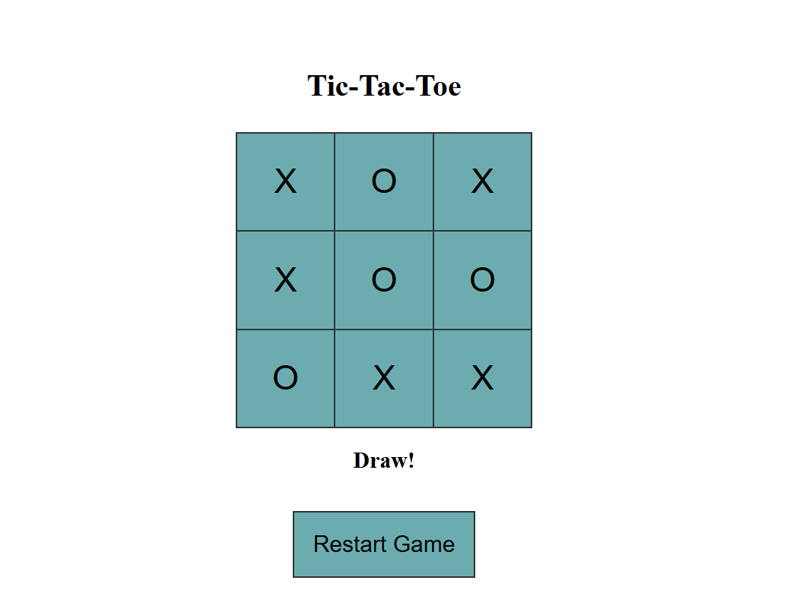

# TicTacToe_Python
Web application in Python using Flask

## Project Structure Creation
- Each layer is a separate module.
- The project structure has the following layers: web, domain, datasource, di.
- The web layer includes the packages model, route, and mapper for interaction with the client.
- The domain layer includes the packages model and service to implement the business logic of the application.
- The datasource layer includes the packages model, repository, and mapper for data handling.
- The di layer describes configurations for dependency injection.

## Implementation of Domain Layer
- The model of the game board is described as an integer matrix.
- The model of the current game, which has a UUID and a game board, is described.
- The interface of the service includes the following methods:
    - A method for obtaining the next move of the current game using the Minimax algorithm.
    - A method for validating the game board of the current game (check that previous moves have not been altered).
    - A method for checking the end of the game.

## Implementation of Datasource Layer
- A storage class for storing current games is implemented.
- Thread-safe collections are used as the storage medium.
- The models of the game board and the current game are described.
- Domain <-> datasource mappers are implemented.
- A repository for working with the storage class is implemented, including the following methods:
    - A method for saving the current game.
    - A method for retrieving the current game.
- A class that implements the service interface and takes the repository as a parameter for interacting with the storage class is created.

## Implementation of Web Layer
- The models of the game board and the current game are described.
- Domain <-> web mappers are implemented.
- A controller using Flask is implemented, having a method POST /game/{UUID of the current game}, which sends the current game with the updated game board from the user and receives in response the current game with the updated game board from the computer.
- Support for multiple games simultaneously is required.

## Implementation of DI Layer
- A Container class is implemented, which describes the dependency graph.
- It contains:
   - A storage class as a singleton;
   - A repository for interacting with the storage class;
   - A service for working with the repository.
